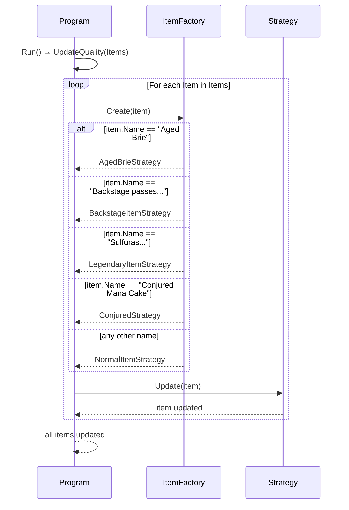

```mermaid
sequenceDiagram
    participant P as Program
    participant IF as ItemFactory
    participant S as Strategy

    P->>P: Run() → UpdateQuality(Items)
    loop For each Item in Items
        P->>IF: Create(item)
        alt item.Name == "Aged Brie"
            IF-->>P: AgedBrieStrategy
        else item.Name == "Backstage passes..."
            IF-->>P: BackstageItemStrategy
        else item.Name == "Sulfuras..."
            IF-->>P: LegendaryItemStrategy
        else item.Name == "Conjured Mana Cake"
            IF-->>P: ConjuredStrategy
        else any other name
            IF-->>P: NormalItemStrategy
        end
        P->>S: Update(item)
        S-->>P: item updated
    end
    P-->>P: all items updated
```