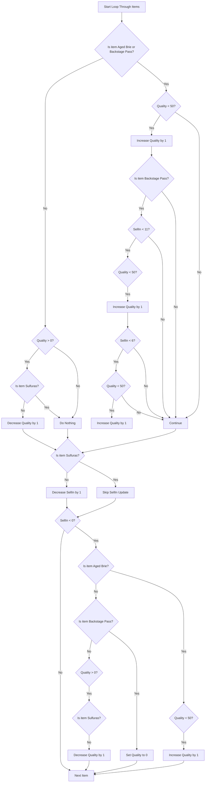

```mermaid
flowchart TD

    A[Start Loop Through Items] --> B{Is item Aged Brie or Backstage Pass?}

    B -- No --> C{Quality > 0?}
    C -- Yes --> D{Is item Sulfuras?}
    D -- No --> E[Decrease Quality by 1]
    D -- Yes --> F[Do Nothing]
    C -- No --> F

    B -- Yes --> G{Quality < 50?}
    G -- Yes --> H[Increase Quality by 1]

    H --> I{Is item Backstage Pass?}

    I -- Yes --> J{SellIn < 11?}
    J -- Yes --> K{Quality < 50?}
    K -- Yes --> L[Increase Quality by 1]

    L --> M{SellIn < 6?}
    M -- Yes --> N{Quality < 50?}
    N -- Yes --> O[Increase Quality by 1]

    M -- No --> P[Continue]
    N -- No --> P
    J -- No --> P
    I -- No --> P
    G -- No --> P

    E --> Q{Is item Sulfuras?}
    F --> Q
    P --> Q

    Q -- No --> R[Decrease SellIn by 1]
    Q -- Yes --> S[Skip SellIn Update]

    R --> T{SellIn < 0?}
    S --> T

    T -- No --> U[Next Item]

    T -- Yes --> V{Is item Aged Brie?}

    V -- No --> W{Is item Backstage Pass?}

    W -- No --> X{Quality > 0?}
    X -- Yes --> Y{Is item Sulfuras?}
    Y -- No --> Z[Decrease Quality by 1]

    W -- Yes --> AA[Set Quality to 0]

    V -- Yes --> AB{Quality < 50?}
    AB -- Yes --> AC[Increase Quality by 1]

    Z --> U
    AA --> U
    AC --> U
```